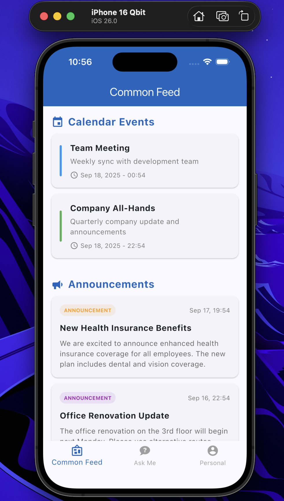
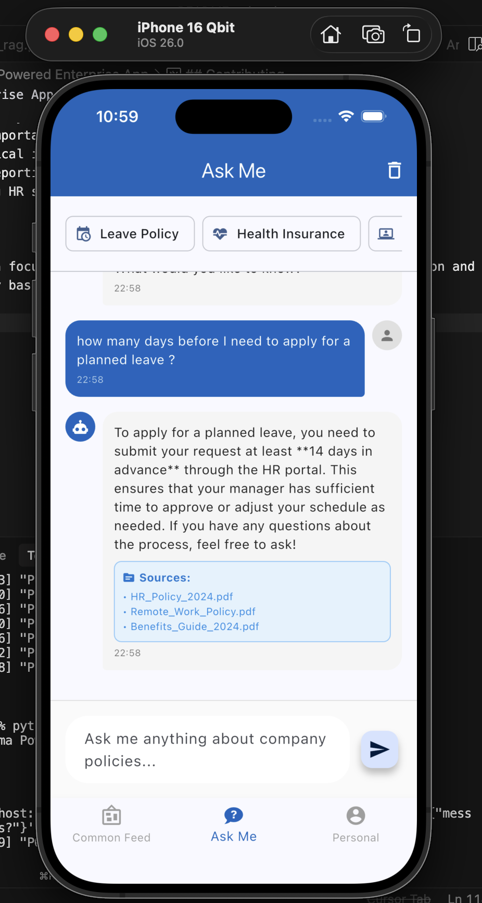
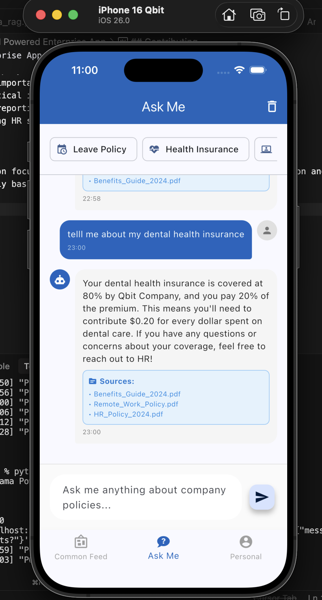
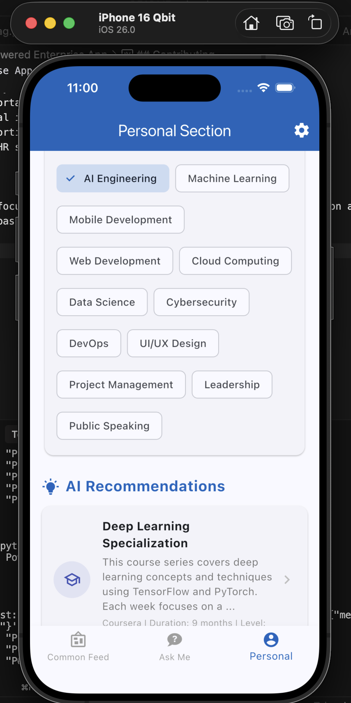

# Qbit - AI Powered Enterprise App

A Flutter application that bridges the gaps between employees and the organization through AI-powered features.

## Features

### 1. Common Feed
- **Calendar Events**: View upcoming meetings and company events
- **Announcements**: Stay updated with organizational announcements
- **AI Newsletter**: Technology-focused content tailored to your interests
- **Celebrations**: Birthday and work anniversary notifications

### 2. Ask Me (AI Assistant)
- Interactive chat interface for company-related queries
- Quick action buttons for common questions
- Simulated responses for:
  - Leave policies and procedures
  - Health insurance information
  - IT support requests
  - Company policies and handbook
  - Payroll and salary information

### 3. Personal Section
- **Profile Management**: View your profile information
- **Interests Selection**: Choose your professional interests
- **Career Goals**: Track your professional development goals with progress indicators
- **AI Recommendations**: Get personalized course and training suggestions
- **Health & Wellness**: Annual checkup reminders and health tips

## Getting Started

### Prerequisites
- Flutter SDK (>=3.0.0)
- Dart SDK
- Android Studio / VS Code with Flutter extensions

### Installation

1. **Clone the repository** (if using version control):
   ```bash
   git clone <your-repo-url>
   cd Qbit
   ```

2. **Install dependencies**:
   ```bash
   flutter pub get
   ```

3. **Run the app**:
   ```bash
   flutter run
   ```

### Project Structure
```
lib/
├── main.dart                 # App entry point
├── screens/
│   ├── home_screen.dart      # Main screen with bottom navigation
│   ├── common_feed_screen.dart   # Common feed with announcements
│   ├── ask_me_screen.dart    # AI chat interface
│   └── personal_screen.dart  # Personal goals and interests
```

## Current Implementation Status

✅ **Completed**:
- Basic Flutter app structure
- Bottom navigation with 3 main tabs
- Common Feed with placeholder content (announcements, events, newsletters, celebrations)
- Ask Me screen with chat interface and simulated AI responses
- Personal Section with interests, goals, and recommendations
- Modern Material Design 3 UI

🔄 **Next Steps** (for future development):
- Backend API integration (Go framework)
- Real AI integration (Claude/GPT with RAG architecture)
- Vector database for company knowledge
- User authentication and profiles
- Real-time notifications
- Calendar integration
- Health metrics tracking
- Advanced goal management

## Technologies Used

- **Frontend**: Flutter (Dart)
- **UI**: Material Design 3
- **Icons**: Material Design Icons Flutter
- **State Management**: StatefulWidget (can be upgraded to Provider/Bloc later)

## Testing the App

The app is fully functional for testing the UI and basic interactions:

1. **Common Feed**: Scroll through different types of content
2. **Ask Me**: Try typing questions about leave policies, health insurance, IT support, etc.
3. **Personal Section**: Select interests, view goals, and explore recommendations

## Future Enhancements

- Integration with company calendar systems
- Real AI backend with company-specific training data
- Push notifications for important announcements
- Offline support for critical information
- Advanced analytics and reporting
- Integration with existing HR systems

## Screenshots

Here are some screenshots showcasing the app's interface and features:

| Screenshot 1 | Screenshot 2 |
|:---:|:---:|
|  |  |

| Screenshot 3 | Screenshot 4 |
|:---:|:---:|
|  |  |
